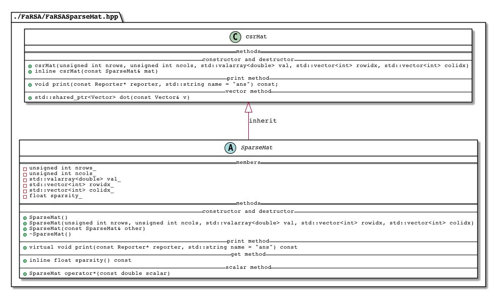

 # Sparse Matrix representation

1. compressed sparse row (CSR)
2. compressed sparse column (CSC)
3. Coordinate list (COO)

And [more](https://en.wikipedia.org/wiki/Sparse_matrix#Compressed_sparse_column_(CSC_or_CCS))...

## compressed sparse row

 This format allows 
 1. fast row access and,
 2. matrix-vector multiplications.

*Toy example*

The representation of  the following matrix 
$$
M=
\begin{pmatrix}
0 & 0 & 0 & 0\\
0 & 5 & 0 & 8\\
3 & 0 & 0 & 0\\
0 & 0 & 6 & 0
\end{pmatrix}
$$

is 

```
val = [5, 8, 3, 6] 
col_idx = [1, 3, 0, 2]
row_idx = [0, 0, 2, 3, 4].
```

The `row_idx` is built recursively. Assume the 0-index rule, then the first element of `row_idx`, i.e. `row_idx[0]`, is always set to 0 and 

```
row_idx[i] = (# nonzero elements in row i-1) + row_idx[i-1]   for i>=1.
```

*How to get elements from CSR representation*:

It's easy to get elements by row. For example, we want to get the elements in the 0-th row (the first row in M)

```
row_start = row_idx[0] = 0
row_end = row_idx[0+1] = 0
```
Since `row_start` is equal to `row_end`, we know the elements in 0-th row are all zeros.

Another example, we want to get the elements in the 1-th row (the second row in M)

```
row_start = row_idx[1] = 0
row_end = row_idx[1+1] = 2
```
In this case, we know the 1-th row contains nonzero elements and their column indices and values are

```
col_idx[0:2]    # {1, 3}
val[0:2]        # {5, 8},
```

which means

```
M[1,1] = 5
M[1,3] = 8
```

# Setup Github

* Fork from `daniel-p-robinson/FaRSAR` refer it as `upstream`. Your copy at your github in called `origin`

```
# git remote -v
origin	https://github.com/Rothdyt/FaRSA.git (fetch)
origin	https://github.com/Rothdyt/FaRSA.git (push)
upstream	https://github.com/daniel-p-robinson/FaRSA.git (fetch)
upstream	https://github.com/daniel-p-robinson/FaRSA.git (push)
```

The purpose of this you can keep `origin` up-to-date with `upstream`.

* Clone `orgin` to  your local computer. It will create a branch named `master`. And then mannually create a working branch named `yutong` and swtich to this branch as a place you play around.

```
  master
* yutong
```

The purpose of this you can keep `master` up-to-date with `origin` without  interfering your working branch, which can be a few commits ahead of the `upstream` and  a few commits behind of the `upstream`.


* Sync your working brach with `orgin`

```
git push origin yutong
git pull origin yutong
```

* Sync your `master` with `orgin`


# C++ Implementation




# Questions

* Should I use `std::valarray<double>`  as the container for `val_`. 
  * Would envison my `val_` is not only a vector of `double` but also a vector of any `numerics` and `bool`. Should I use the template scheme?
  * Provide the `indexing(slicing)` functionality, i.e., `M[1:2, :]`. Both return by copy and return by view.

* Interaction with `FaRSA::Vector`

```cpp
# hpp
Vector dot(const Vector& v);

# cpp
Vector csrMat::dot(const Vector& v) {
  Vector ans(v.length());
  for (int row = 0; row < nrows_; row++) {
    unsigned int row_start = rowidx_[row];
    unsigned int row_end = rowidx_[row + 1];
    if (row_end == row_start) {
      ans.set(row, 0.0);
    } else {
      double temp = 0;
      for (int i = row_start; i < row_end; i++) {
        int colId = colidx_[i];
        temp += val_[i] * v.values()[colId];
      }
      ans.set(row, temp);
    }
  }
  return ans;
}

"FaRSA::Vector::Vector(const FaRSA::Vector &)" (declared at line 208 of "/Users/ym/Documents/Optimization_Software/FaRSA/FaRSA/src/FaRSAVector.hpp") is inaccessible
```

Why return the object will invoke the copy constructor?

* Inherentance and type conversion.

```cpp
SparseMat SparseMat::operator*(double scalar) {
  std::valarray<double> newval_ = scalar * val_;
  return SparseMat(nrows_, ncols_, newval_, rowidx_, colidx_);
}

std::valarray<double> val = {5.0, 8.0, 3.0, 6.0};
std::vector<int> rowidx = {0, 0, 2, 3, 4};
std::vector<int> colidx = {1, 3, 0, 2};
csrMat m(4, 4, val, rowidx, colidx);
csrMat mnew = m * 3.0;  // be careful of type conversion
```